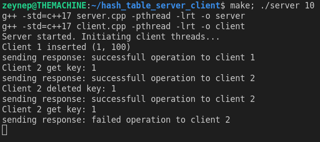
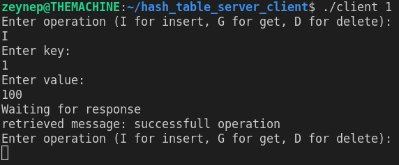
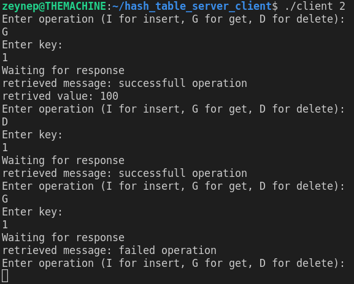

# Concurrent Hash Table Client-Server Application with Shared Memory Communication

This is a multi-threaded client-server system that provides concurrent access to a hash table data structure. The server component initializes a hash table of a specified size and supports insert, get, and delete operations on the hash table. The hash table handles concurrent operations using a readers-writer lock mechanism to ensure thread safety. Clients communicate with the server using shared memory buffers to enqueue requests and receive responses.

## Hash table

This implementation resolves collisions by maintaining a linked list for each bucket, allowing multiple key-value pairs to be stored at the same index. The use of shared and unique locks ensures thread safety during concurrent operations, allowing multiple readers and exclusive writers to access the hash table safely.

Insert method uses **std::unique_lock** and get method uses to ensure exclusive access for writing and Get method **std::shared_lock** to allow multiple readers.

## Server

 The server listens for requests from multiple clients using shared memory buffers. It spawns client threads to handle client requests concurrently. Server allocates sizeof(Response) + sizeof(Request) shared memory to each client. Once a request is found in the shared memory dedicated for the client's requests, the client thread invokes the server's processRequest method to handle the request. Server prepares the response, and stores it back in the shared memory buffer dedicated for the client's response.

 ## Client

The client program takes a client ID as a command-line argument and connects to the server's shared memory buffer associated with that client ID. It then enters an infinite loop where it prompts the user to enter an operation (I for insert, G for get, D for delete) and the corresponding key. For insert operations, the user is also prompted to enter the value.

 Maximum number of clients are currently set to 10 and could be changed in server.cpp.

## How to run

This project is tested on an Ubuntu 18 machine.

- **make**. This will create two executables, namely **server** and **client**.
- **./server tableSize** where **tableSize** represents the hash table size and it can be any positive integer.
- On an another terminal run **./client clientId** where **clientId** is a number from 1 to 10 (you may run up to 10 clients this way.)

## Sample run

